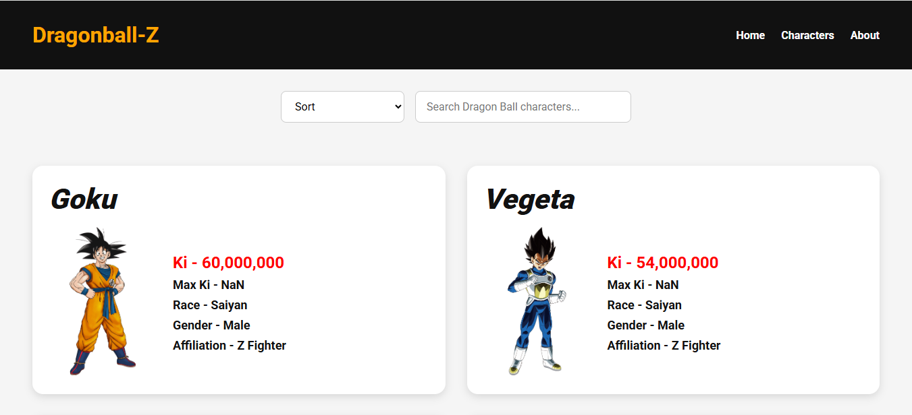

# Dragon Ball API Application

An interactive frontend application that retrieves Dragon Ball character data from an external REST API and dynamically renders the results in the browser.

This project was built to strengthen my understanding of JavaScript, API integration, asynchronous data handling, DOM manipulation, and responsive frontend development.

## Features

- Fetches character data from an external REST API
- Dynamically renders character information in the browser
- Interactive frontend experience
- Responsive layout for different screen sizes
- JavaScript-based data handling and UI updates

## Tech Stack

- HTML
- CSS
- JavaScript
- REST API
- Fetch API
- Git
- GitHub

## What I Practiced

This project helped me strengthen my understanding of:

- Working with external APIs
- Using `fetch()` and asynchronous JavaScript
- Handling API responses
- Rendering data dynamically
- DOM manipulation
- Organizing frontend application logic
- Responsive web design

## Screenshot

## Live Demo

[View the Live Application](https://ajford3866.github.io/dragon-ball-api/)

## Source Code

This repository contains the source code for the project.

## Author

**Al Ford**

AI & SaaS Product Builder focused on practical software, business automation, and modern web applications.
